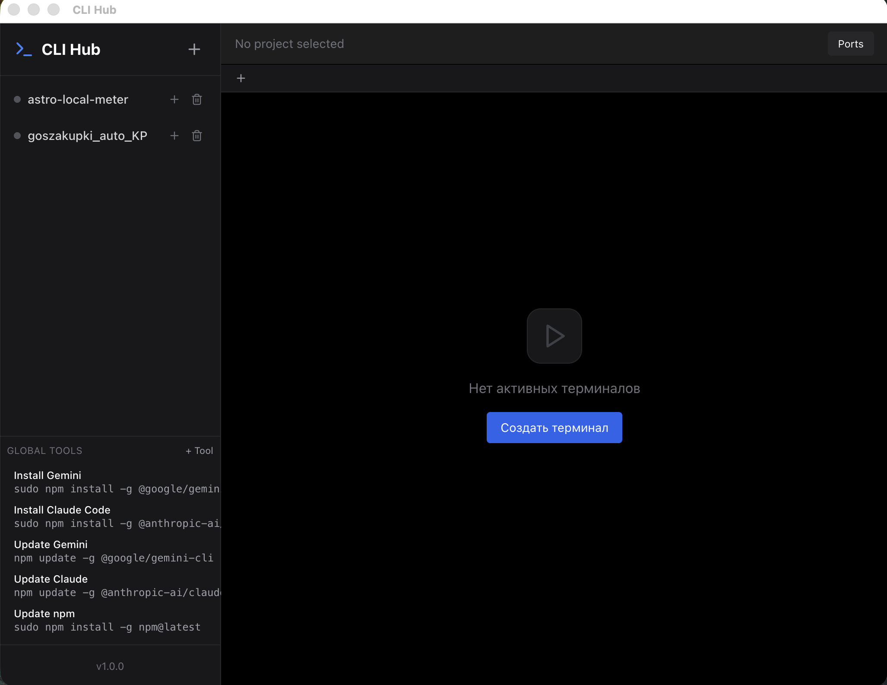

# 🚀 CLI Hub

<p align="center">
  
</p>

<p align="center">
  <b>One place to manage projects and run their commands without remembering them</b>
</p>

<p align="center">
  
  
  
  
  
</p>

---

## 🌐 English

**CLI Hub** is a desktop app that keeps all your projects and their commands in one place. Open a project, see the available scripts/tools, run them with one click, and switch between running tasks without retyping long commands.

### ✨ Key Features

-   **📂 Workspace-Based Organization**: Group terminal commands by project or environment. No more searching through history for that one Docker command.
-   **🖥️ Isolated Terminal Tabs**: Each command runs in its own dedicated, high-performance PTY session (powered by `xterm.js`).
-   **📊 Smart Port Monitor**: A built-in real-time view of active ports. See what's running and free up ports with a single click.
-   **🛡️ Reliable Process Management**: Handles `SIGINT` and `SIGTERM` correctly, ensuring no "zombie" processes are left behind when you close the app.
-   **🔄 Session Persistence**: Automatically restores your workspaces and running session configurations after a restart.
-   **🎨 Premium UI/UX**: Built with a modern, dark-themed aesthetic that looks great and feels fast.

### ⌨️ Keyboard Shortcuts

| Shortcut | Action |
|----------|--------|
| `Ctrl+T` / `Meta+T` | Create new terminal |
| `Ctrl+W` / `Meta+W` | Close current terminal |
| `Ctrl+Tab` | Switch to next terminal |
| `Ctrl+Shift+Tab` | Switch to previous terminal |
| `Escape` | Close modal dialogs |

### 🛠️ Tech Stack

-   **Frontend**: React + TypeScript + Vite
-   **Backend**: Electron (Node.js)
-   **Terminal**: xterm.js + node-pty
-   **Styling**: Tailwind CSS + Lucide Icons
-   **State Management**: Zustand
-   **Storage**: electron-store

### 🚀 Getting Started

1.  **Clone the Repo**:
    ```bash
    git clone https://github.com/nbiotminsk/CLI_HUB.git
    cd CLI_HUB
    ```
2.  **Install Dependencies**:
    ```bash
    npm install
    ```
3.  **Run in Development Mode**:
    ```bash
    npm run dev:electron
    ```
4.  **Build Production App**:
    ```bash
    npm run dist
    ```

---

## 🇷🇺 Русский

**CLI Hub** — настольное приложение, где все проекты и их команды собраны в одном месте. Открыл проект, увидел список скриптов/инструментов, запустил в один клик и быстро переключаешься между задачами без ручного ввода команд.

### ✨ Основные возможности

-   **📂 Организация через Workspace**: Группируйте команды по проектам. Создавайте именованные пресеты для каждой задачи (например, `frontend:dev`, `docker:up`).
-   **🖥️ Изолированные вкладки**: Каждая команда запускается в собственной PTY-сессии с использованием `xterm.js`.
-   **📊 Монитор портов**: Мгновенный обзор занятых портов. Узнайте, какой процесс занимает порт, и освободите его одним нажатием кнопки.
-   **🛡️ Безопасное завершение**: Приложение корректно завершает все дочерние процессы, предотвращая появление "зомби-процессов" в системе.
-   **🔄 Сохранение состояния**: Ваши рабочие области и настройки команд автоматически восстанавливаются при перезапуске.
-   **🎨 Премиальный дизайн**: Современный тёмный интерфейс, спроектированный для комфортной долгой работы.

### ⌨️ Клавиатурные сокращения

| Сокращение | Действие |
|------------|----------|
| `Ctrl+T` / `Meta+T` | Создать новый терминал |
| `Ctrl+W` / `Meta+W` | Закрыть текущий терминал |
| `Ctrl+Tab` | Переключиться на следующий терминал |
| `Ctrl+Shift+Tab` | Переключиться на предыдущий терминал |
| `Escape` | Закрыть модальное окно |

### 🚀 Быстрый старт

1.  **Установка**:
    ```bash
    npm install
    ```
2.  **Запуск в режиме разработки**:
    ```bash
    npm run dev:electron
    ```
3.  **Сборка приложения**:
    ```bash
    npm run dist
    ```

---

<p align="center">
  Made with ❤️ for developers
</p>
